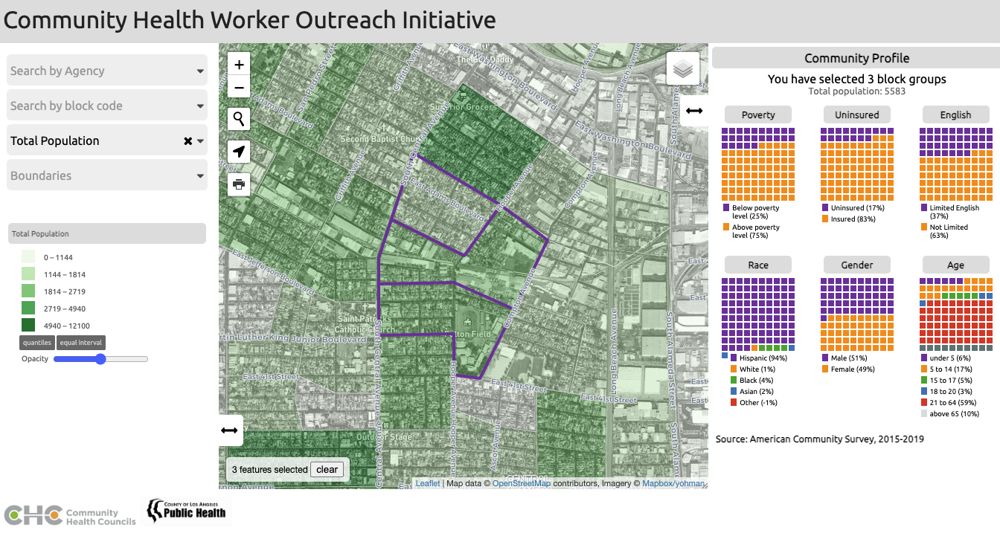
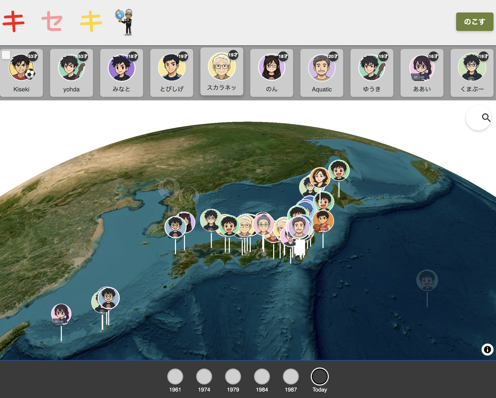
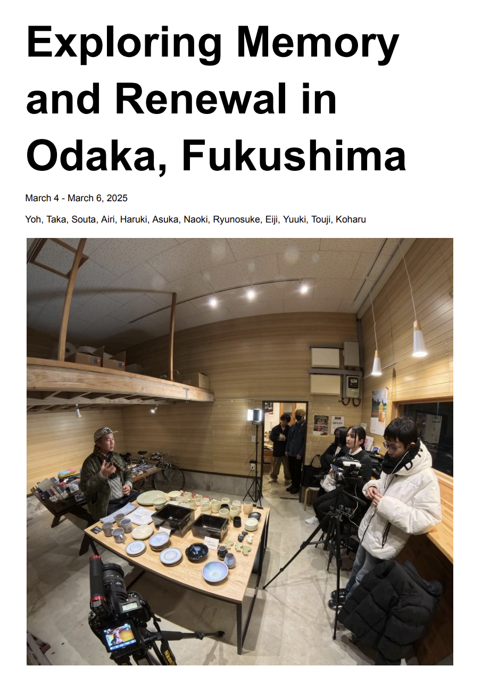
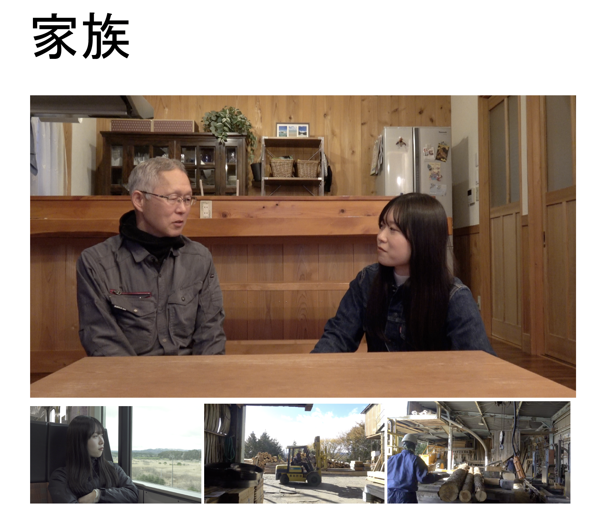
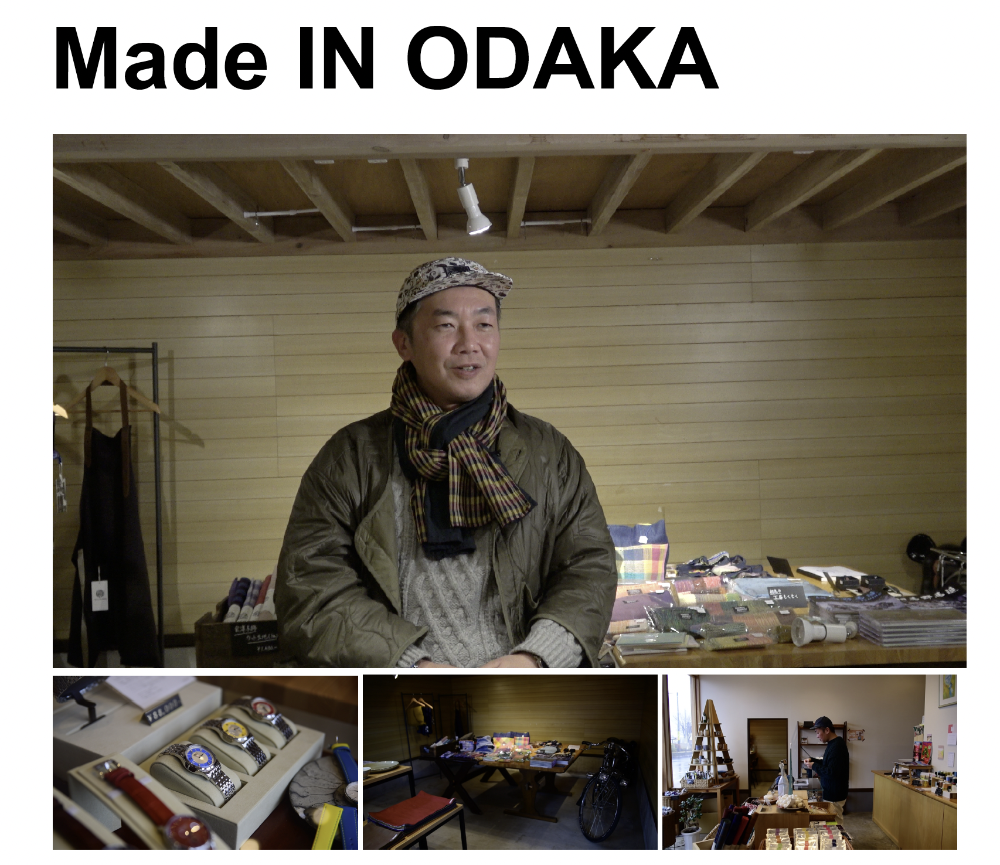
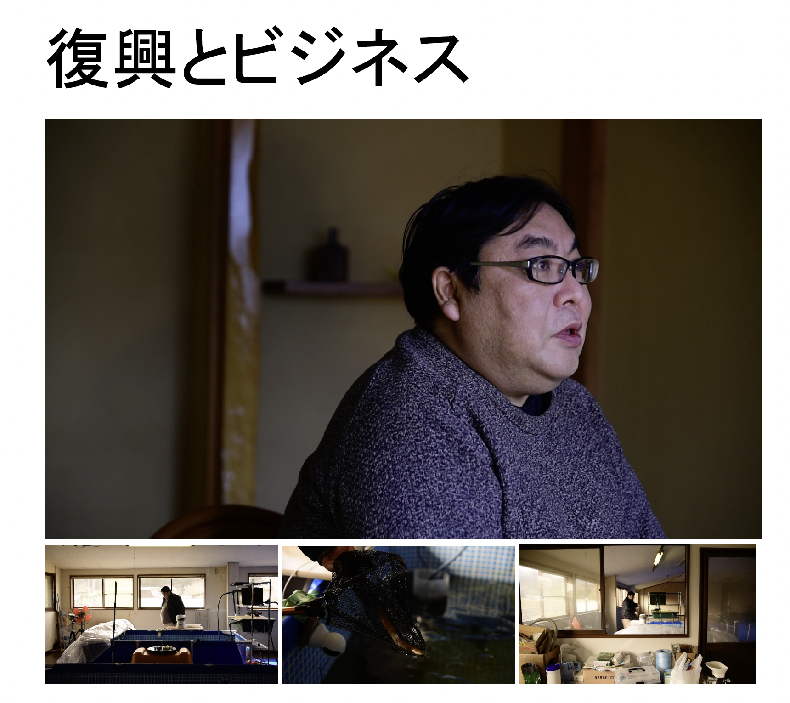
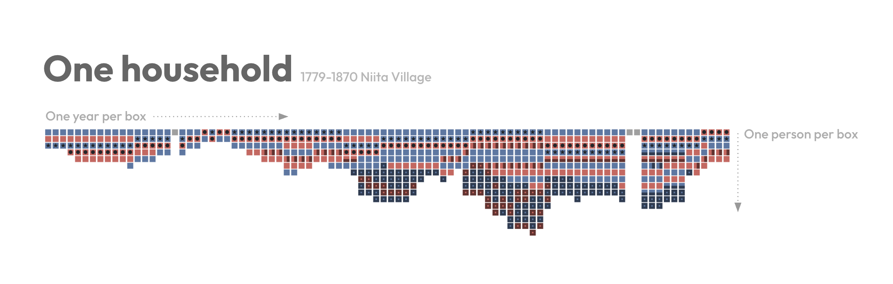

# Why me?

#

Are you <large><red>creative?

Do you have a <large><red>passion for justice?</red></large>

Do you like to <large><red>think outside the box?

#

Engineering X <large><red>Spatial</red>

#

# 

Engineering X <large><red>Ethnography

#

#

#

# 

#

#

#

Engineering X <large><red>Design

#

# 

Engineering X <large><red>Global

# 

Engineering X <large><red>Global Spatial Ethnographic Design
